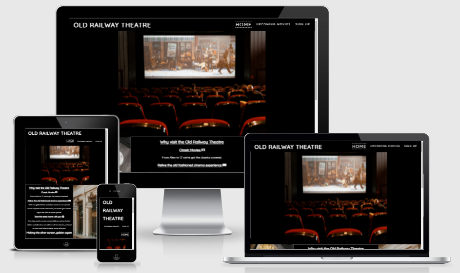
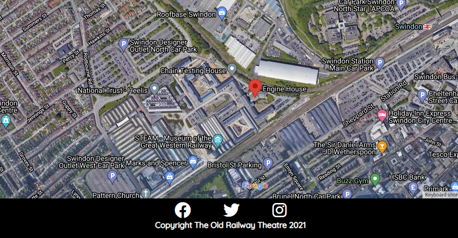
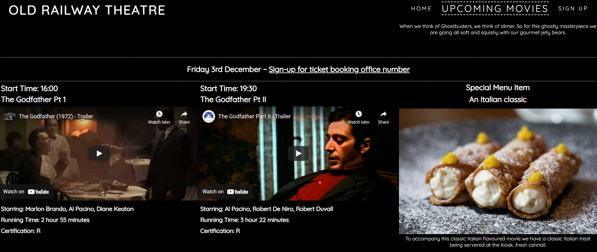
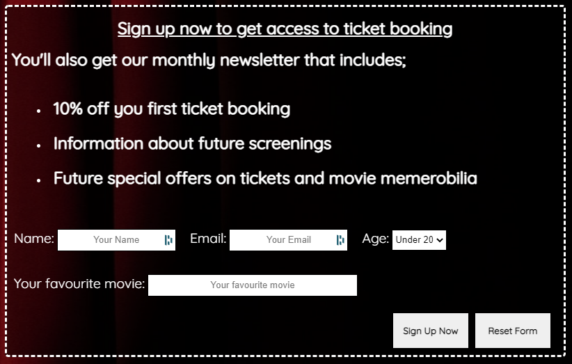
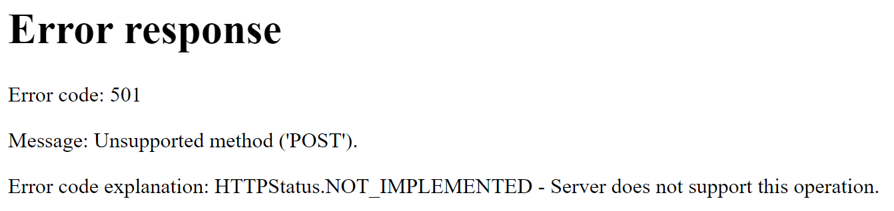

# The Old Railway Theatre

The Old Railway Theatre website is designed to give any potential customers a flavour of what it would be like to go and watch a movie there. The site is aimed directly at people who enjoy 'classic' movies, that is to say that the movies played here are not new releases, but instead movies with a cult following.

In order to standout from the mainstream cinemas who offer a similar experience, the Old Railway Theatre also offer some movie themed snacks and treat to accompany the movie experience. Alongside the special snacks there is also the overall astetic of the theatre itself with an old fashioned, gilded ticket collection kiosk.

Users of this website are given the above flavour when they land on the home page. This is then built on when the user goes to the 'Upcoming Movies' page where the user is met with information as to what movies are playing, along with clickable links to trailers that are on YouTube. Again alongside the movie information there is a visual offering of what the 'special' movie themed snack will be, where possible it will be themed to the movie that is playing.

# Features

The site is currently made up of 3 pages, Home, Upcoming Movies and a Sign Up page. Each of these pages has a header section with the website logo and nav bar in place. This header section stays visible no matter how far down the user scrolls. This is a personal preference, as I think the user should be able to navigate without having to scroll back to the top of the page first.

## Home Page

The home page has a section explaining what the theatre has to offer and some images that frame this information in the center. Below the about section there is a map section that shows the location of the theatre. This map is embeded from google maps.

## Upcoming Movies Page

The Upcoming movies page has the same header and social media links. However the body of the page is made up of 3 sections, 1 for each day. The section shows the movies playing in the 2 time slots followed by a special menu item (as below).

There is a clickable link next to the date above the movie trailers. This link takes the user to the sign up page. The user would need to sign up in order to get the ticket booking number.

## Sign Up Page

The sign up page has a form for the user to complete in order to sign themselves up to the newsletter and receive the ticket booking number.

# Testing

The site has been loaded on Google Chrome, Edge, Opera and Firefox and loads as expected with working links.

# Bugs

There was an issue in the links to the sign up page, both form the home and upcoming movies pages. This was because when writing the link I had written the page name as 'sign up', once found I added the missing '-' making the file name sign-up.html.

While testing the deployment of the site there was a problem with the images not loading. To resolve this I needed to add a . before the location of the image file as below;

Before: "/assets/images/hero-image.png

After: "./assets/images/hero-image.png

There is still an issue with the sign up button, in testing I received the below error message.

This will need further work in order to rectify.

# Validation

W3C HTML validator returned some errors, but these were in the embeded code for the YouTube links to the movie trailers. The error was for the 'frameborder' attribute on the iframe element. I decided not to adjust these iframes as they were lifted directly from YouTube and my understanding of this is limited. My only adjustment to these iframes was to remove the height and width styling that was inline styled and use the style sheet to make these adjustments.

W3C Css validator passed the code with no errors.

I ran the lighthouse report and the scores are as below.

# Deployment

What we did to deploy our site - example shows step by step on how to deploy

# Credits

## Content

## Media

Who helped and where images came from etc.