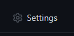
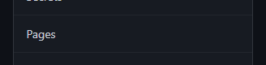
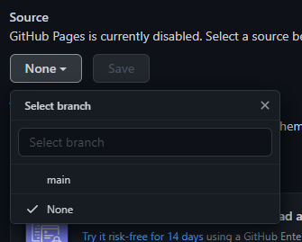
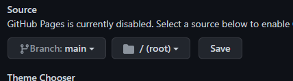
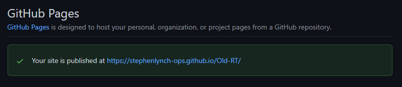
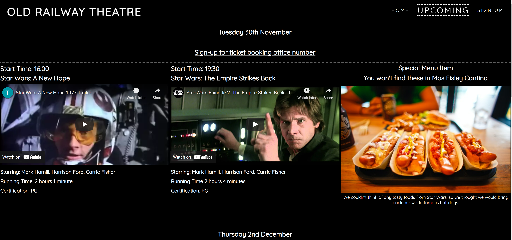
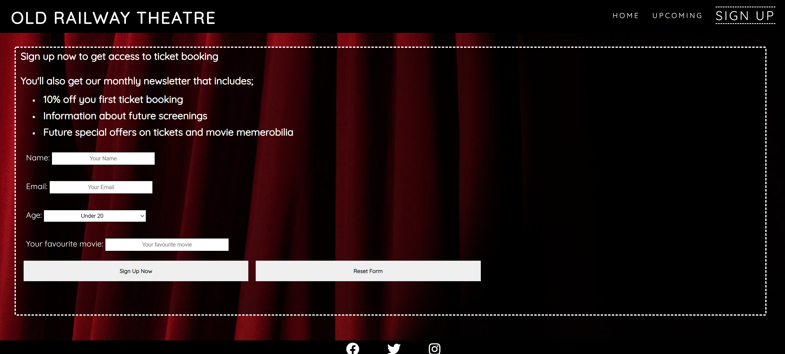

# The Old Railway Theater

## HTML / CSS Essentials Project

The website is designed to show any potential customer what 'The Old Railway Theater' does and what special items it has that makes it different from other cinemas.

The users can easily find the movies that are planned in the coming days and by signing up can obtain a a telephone number to book tickets.

### [View the live website in Github pages](https://stephenlynch-ops.github.io/Old-RT/)

## Table of contents

- UX
    - [Business goals](#Business-goals)
    - [User goals](#User-goals)
    - [Structure of the website](#Structure-of-the-website)
    - [Website palette](#Website-palette)
- [Features](#Features)
- [Technology](#Technology)
- [Testing](#Testing)
    - [Functionality testing](#Functionality-testing)
    - [Compatability testing](#Compatability-testing)
    - [Code Validation](#Code-validation)
    - [Issues found during testing](#Issues-found-during-testing)
    - [Performance testing](#Performance-testing)
- [Deployment](#Deployment)
- [Credits](#Credits)
- [Screenshots](#Screenshots)

# UX

## Business goals

The Old Railway Theatre website is designed to give any potential customers a flavour of what it would be like to go and watch a movie there. The site is aimed directly at people who enjoy 'classic' movies, that is to say that the movies played here are not new releases, but instead movies with a cult following.

In order to standout from the mainstream cinemas who offer a similar experience, the Old Railway Theatre also offer some movie themed snacks and treat to accompany the movie experience. Alongside the special snacks there is also the overall astetic of the theatre itself with an old fashioned, gilded ticket collection kiosk.

## User goals

- Users are given a taste of the movie experience at the Old Railway Theater
    - Large cinema screens
    - Guilded ticket collection kiosks
- Read about how the experience is more 'special' than visiting any other cinema
- Locate the Old Railway Theater using the embedded map
- Users can preview upcoming movies via the trailers
- As well as the movie previews there are shots of the special menu items that accompany the movies
- Users can sign up to get the exclusive ticket booking line number

## Structure of the website

The website has been designed to be responsive and easy to use / navigate accross both static and mobile devices.

Users get feedback when they hover over the clickable links within the site.

## Website palette

The colors were picked to best replicate the feel within a cinema, so a dark backgound and by contrast bright text has been used throughout the site.

- Background color: #000
- Font color: #fff

[Table if contents](#Table-of-contents)

# Features

The website has a simple three page format - home, upcoming and sign-up pages.

The site also has the following features;

### Navigation bar

- Navigation bar is visible on each page and highlights the page the user is currently on by increase the font size of the page name and by including both a bottom and top border around the page name.

- The navigation bar sits in the top right of the page opporsite the sites title.

- On smaller screens the navigation bar sits below the site title.

### Footer

- The footer is consitant on each page and consists of the 3 social media links (Facebook, Twitter and Instagram). It also contains the copyright text.

### Home page

- Hero image section

    - This shows the cinema screen and seating from within the cinema viewing area. It is wide and attempts to simulate the viewing position from within the cinema itself.

- About section

    - This gives the user a few lines about how the Old Railway Theater is different to other cinemas. This section also includes image(s) that show some of these differences, namely the guilded ticket collection kiosks.

- Map section

    - This allows the user to locate the theater within the old railway quarter of Swindon by using the embedded google map.

### Upcoming page

- Three daily movie preview sections.

    - Each section shows that days two movie previews as well as giving some information about the movie, rating, length and actors / actresses who are in the movie.

    - Each section also has a clickable link under the date that takes the user to the sign-up page with the promise that if they sign up they will recevie a ticket booking line number in order to make a booking.

    - There is also a 'special menu item' that is previewed at the bottom of each section, that shows what special food will accompany that days viewings.

### Sign-up page

- Sign-up section

    - There is a list of the benefits for the person who signs up.

    - There is also a form for the user to complete that includes their;
        - name
        - email address
        - age group
        - favourite movie
    
    - The form also contains a submit button and a form reset button. Currently the submit button has no function.

### Future implementations

- The submit button will need to be linked to a database in order for the business to process the users input information.

- The upcoming movies will need to be constantly updated as per the calander of movies to be shown.

- The site will also need to be upgraded to allow for tickets to be booked online, this will mean the site will need to give the user the ability to log in so they can access the benefits that the memebers are entitled to.

[Table if contents](#Table-of-contents)

# Technology

### HTML

- The structure language of the site

### CSS

- The style language of the site

### Font Awesome

- The library for the social media icons used in the footer

### Google fonts

- For the fonts used throughout the site

### Github

- Where the site is hosted

### Gitpod

- Where the site was developed

[Table if contents](#Table-of-contents)

# Testing

## Functionality testing

I developed the site using Chrome developer tools and laterly using Firfox developer tools.

## Compatability testing

I tested the mobile compatability for the site using the default options on Chrome which covered everything from Galaxy fold to Nest Hub Max. 

## Code validation

The code has been run through validator.w3.org to check the the validity of the HTML with no errors or warnings.

The CSS was tested using jigsaw.w3.org and again no errors were found.

## Issues found during testing

When testing the deployment of the site I had an issue with the images not loading. This was because of an error in the root to access the images.

    Before: "/assets/images/hero-image.png

    After: "./assets/images/hero-image.png

There was also an issue with the submit button on the sign-up page, in that it gave me an error message when testing it.

After consulting with my mentor he suggested that for this project I didn't need the action and method for the button as that was above the scope of this project. I removed this code.

There were visual issue with the upcoming page when viewed on smaller screens. This was due to too much information being squeezed across the screen. Again after consulting my mentor he suggested that I stack this content to make the overall page less cramped and easier to use by users and less of a strain on the eyes.

## Performance testing

- Site has been evaluated by lighthouse and the score card is below.

[Table if contents](#Table-of-contents)

# Deployment

The site is deployed from GitHub. In order to do this I carried out the following actions;

1. Click settings

2. Click pages

3. Click the 'none' button and select 'main' from the drop down box

4. Click the save button

5. Click the link to the page - after a small wait

[Table if contents](#Table-of-contents)

# Credits

The site in influenced by the love running and coders coffeehouse sites, however where possible I tried to build on the lessons from these sites.

I found w3schools.com very helpful for any further explanation I needed on turning an idea into a working element. I used this more for CSS than HTML.

My mentor helped me iron out a couple of issues I had, as above.

For the media used within the site, all of the images are from Pexels as below;

    Cinema Screen Photo by Tima Miroshnichenko from Pexels
    Tickets Photo by Charlotte May from Pexels
    Confectionary Photo by Pavel Danilyuk from Pexels
    Cannoli Photo by Valeria Boltneva from Pexels
    Jellybears Photo by Pixabay from Pexels
    Hotdog Photo by Caleb Oquendo from Pexels
    Red curtain Photo by cottonbro from Pexels

# Screenshots

## Home page

## Upcoming page

## Sign-up page

[Table if contents](#Table-of-contents)